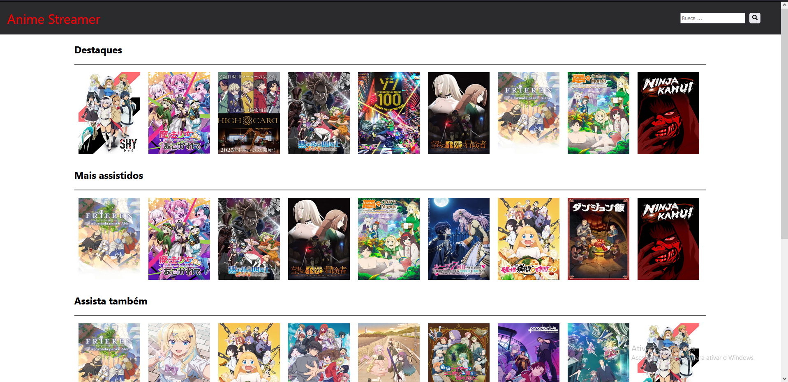

# Anime Streamer

Bem-vindo ao Anime Streamer, sua plataforma online para assistir e descobrir seus animes favoritos!

Sequer o link para o GitHub.[Click aqui](https://github.com/ansderson122/projeto-web-parte1)

## Índice

- [Anime Streamer](#anime-streamer)
  - [Índice](#índice)
  - [Sobre](#sobre)
  - [Capturas de Tela](#capturas-de-tela)
  - [Instalação](#instalação)
  - [Como Usar](#como-usar)
  - [Motivação do Projeto e Funcionalidades Principais](#motivação-do-projeto-e-funcionalidades-principais)
    - [Solução Geral](#solução-geral)
    - [Atividades Principais](#atividades-principais)
    - [Diferencial da Proposta](#diferencial-da-proposta)
    - [Público Alvo](#público-alvo)

## Sobre

O Anime Streamer é um projeto React que visa proporcionar uma experiência envolvente para os amantes de animes. Com uma interface intuitiva, oferece recursos de busca, reprodução de vídeos e muito mais.

## Capturas de Tela



## Instalação

1. Clone este repositório: 
```bash
  git clone https://github.com/ansderson122/projeto-web-parte1.git
```
1. Navegue até o diretório do projeto: 
```bash
  cd projeto-web-parte1
```
1. Instale as dependências: 
```bash
  npm install
```

## Como Usar

1. Inicie o aplicativo: 
```bash
  npm start
```
2. Abra seu navegador e vá para `http://localhost:3000`


## Motivação do Projeto e Funcionalidades Principais

O Anime Streamer foi concebido para oferecer aos amantes de animes uma plataforma envolvente e acessível para descobrir, assistir e compartilhar seus animes favoritos. O projeto foi motivado por diversas considerações:

### Solução Geral

- **Plataforma de Streaming de Animes:**
  - Proporcionar uma solução centralizada para a transmissão de animes de alta qualidade.

### Atividades Principais

- **Exploração de Animes:**
  - Permitir aos usuários explorar uma ampla variedade de animes por meio de uma navegação intuitiva por categorias.

- **Registro e Autenticação:**
  - Facilitar o registro de novos usuários e a autenticação para uma experiência personalizada.

- **Reprodução de Vídeos (Simulado):**
  - Oferecer uma experiência simulada de reprodução de vídeos para dar aos usuários uma prévia do que esperar.

### Diferencial da Proposta

- **Sistema Responsivo:**
  - Desenvolver o sistema de forma responsiva, garantindo uma experiência otimizada em dispositivos móveis e desktop.

### Público Alvo

- **Amantes de Animes:**
  - Direcionado para entusiastas de animes de todas as idades que buscam uma plataforma confiável para explorar, assistir e interagir com conteúdos relacionados a animes.

Esses elementos fundamentais orientam a concepção e o desenvolvimento contínuo do Anime Streamer, visando proporcionar uma experiência única aos usuários.

